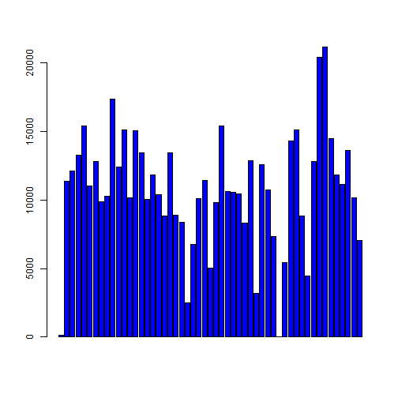
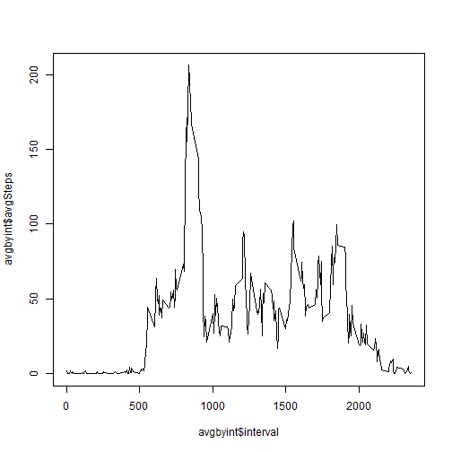
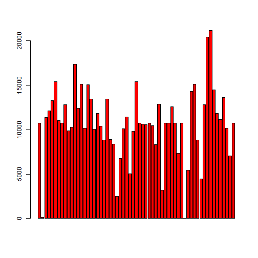
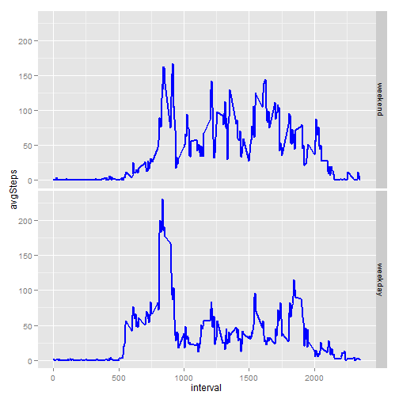

#### Reproducible Research
#### Peer Assessment 1
#### author: dandelion
#### file name: "PA1_template.Rmd"
#### output: html_document


```r
# setwd ()
setwd ("D:/Home/Coursera/05ReproducibleResearch/RepData_PeerAssessment1")
```


### Loading data


```r
# Get raw data ---------------------
activity <- read.csv ("activity/activity.csv")
```

========================================================================

### Mean total number of steps taken per day
The missing values in the dataset have been removed:


```r
# remove NAs
a_rmna <- subset(activity,!is.na(steps))
```

### Histogram of the total number of steps taken each day


```r
# summarize by date
# data <- a_rmna %.% group_by(date) %.% summarize(sum(steps))
data <- summarize(group_by(a_rmna,date),totalSteps=sum(steps))
barplot(data$totalSteps,col="blue")
```

 


### the mean and median total number of steps taken per day


```r
meanOfSteps <- summarize(data,mean(totalSteps))
medianOfSteps <- summarize(data,median(totalSteps))
```


 
========================================================================

### The average daily activity pattern

Time series plot of the 5-minute interval and the average number of steps taken:


```r
avgbyint <- summarize(group_by(a_rmna,interval),avgSteps=mean(steps))
plot(avgbyint$interval,avgbyint$avgSteps,type="l")
```

 

The 5-minute interval that, on average, contains the maximum number of steps.
Here is the top 

```r
arrange(avgbyint,desc(avgSteps))
```

```
## Source: local data frame [288 x 2]
## 
##    interval avgSteps
## 1       835 206.1698
## 2       840 195.9245
## 3       850 183.3962
## 4       845 179.5660
## 5       830 177.3019
## 6       820 171.1509
## 7       855 167.0189
## 8       815 157.5283
## 9       825 155.3962
## 10      900 143.4528
## ..      ...      ...
```
 

========================================================================

### Inputting missing values

The total number of missing values in the dataset:


```r
# remove NAs
nrow (subset(activity,is.na(steps)))
```

```
## [1] 2304
```

Strategy for filling in the missing values in the dataset is the mean for that 5-minute interval:


```r
activity.na <- subset(activity,is.na(steps))
merged <- merge(activity.na,avgbyint)
merged$steps <- NULL
# outer join
activity.mod <- merge(activity,merged,by=c("date","interval"),all.x=TRUE)
bool.na=is.na(activity.mod$steps)
activity.mod[bool.na,"steps"] <- activity.mod[bool.na,"avgSteps"]
```

The new dataset equal to the original but with the missing data filled in:


```r
activity.mod$avgSteps <- NULL
data.mod <- summarize(group_by(activity.mod,date),totalSteps=sum(steps))
```


Histogram of the total number of steps taken each day after missing values input:


```r
barplot(data.mod$totalSteps,col="red")
```

 

### Mean and median after the missing values input
These values slightly differ from the estimates from the first part of the assignment.


```r
meanOfSteps <- summarize(data.mod,mean(totalSteps))
medianOfSteps <- summarize(data.mod,median(totalSteps))
```


========================================================================


### A new factor variable is added to the dataset with two levels – “weekday” and “weekend”


```r
library (timeDate)

activity.wd <- mutate (activity.mod,typeOfDay=isWeekday(activity.mod$date,wday=1:5))
activity.wd$typeOfDay <- factor(activity.wd$typeOfDay,labels=c("weekend","weekday"))
```

### Panel plot containing a time series plot of the 5-minute interval and the average number of steps, averaged across all weekdays or weekends:


```r
library (ggplot2)

x <- summarize(group_by(activity.wd,interval,typeOfDay),avgSteps=mean(steps))

p1=ggplot(data=x,aes(x=interval,y=avgSteps))
p1=p1+geom_line(color="blue",size=1)
p1=p1+facet_grid(typeOfDay~.)
p1
```

 


